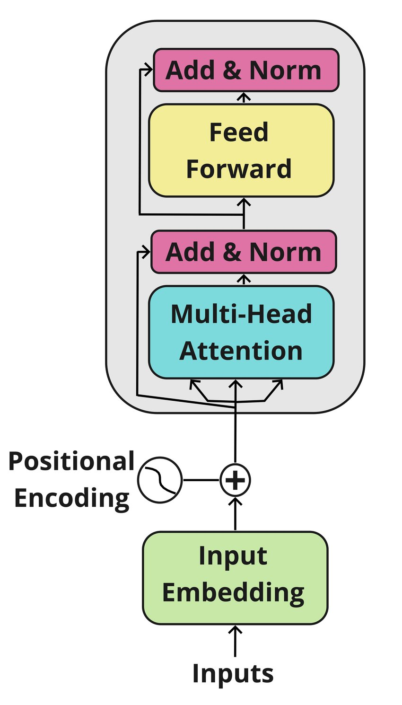
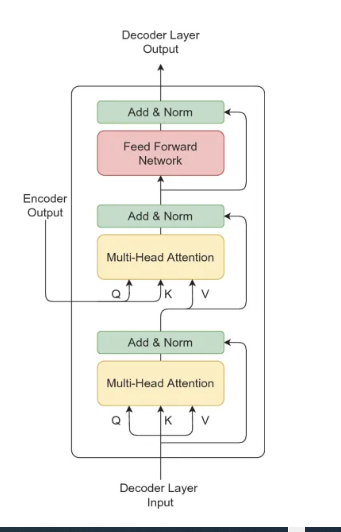

1. [Transformeurs](#Transformeurs)

    1.1 [La Fonction pipeline ](#La-fonction-pipeline)

    1.2 [Le Transfert Learning](#Le-Transfert-learning)

    1.3 [Comparaison avec les modèles précédents (RNN, LSTM)](#comparaison-avec-les-modèles-précédents-rnn-lstm)

2. [Architecture des Transformeurs](#architecture-des-transformeurs)

    2.3 [Tokenisation](#tokenisation)
    
    2.2 [vocabulaire](#vocabulaire)

    2.3 [Embeddings](#embeddings)

    2.4 [Encodage de position](#encodage-de-position)

    2.5 [Mecanisme d'attention](#mecanisme-dattention)

    2.6 [Feed Forward](#feed-forward)
    
    2.7 [Encodeur](#encodeur)

    2.8 [Decodeur](#decodeur)
  


# Transformeurs

Les transformeurs sont une architecture de réseau neuronal utilisée principalement dans le traitement du langage naturel (NLP) et dans les tâches de traduction automatique. Ils ont été introduits dans le papier "Attention is All You Need" par Vaswani et al. en 2017. 


# La fonction pipeline

L'objet le plus fondamental dans la bibliothèque 🤗 Transformers est la fonction `pipeline()`. Elle connecte un modèle avec ses étapes de prétraitement et de post-traitement nécessaires, nous permettant d'entrer directement n'importe quel texte et d'obtenir une réponse intelligible.

```javascript
from transformers import pipeline

classifier = pipeline("sentiment-analysis")
classifier("I've been waiting for a HuggingFace course my whole life.")
```

```javascript
[{'label': 'POSITIVE', 'score': 0.9598047137260437}]
```
On peut même passer plusieurs phrases !


```javascript
classifier(
    ["I've been waiting for a HuggingFace course my whole life.", "I hate this so much!"]
)
```

Par défaut, ce pipeline sélectionne un modèle pré-entraîné particulier qui a été affiné pour l'analyse des sentiments en anglais. Le modèle est téléchargé et mis en cache lorsque vous créez l' classifierobjet. Si vous réexécutez la commande, le modèle mis en cache sera utilisé à la place et il n'est pas nécessaire de télécharger à nouveau le modèle.

Trois étapes principales sont impliquées lorsque vous transmettez du texte à un pipeline :

- Le texte est prétraité dans un format que le modèle peut comprendre.

- Les entrées prétraitées sont transmises au modèle.

- Les prédictions du modèle sont post-traitées afin que vous puissiez les comprendre.

voici une liste de certains  des pipelines actuellement disponibles que vous pouvez tester en lisant la documentation:

- fill-mask
- ner(reconnaissance d'entité nommée)
- question-answering
- sentiment-analysis

# Le Transfert learning

Le transfert learning (ou apprentissage par transfert) est une technique en apprentissage automatique et en intelligence artificielle où un modèle formé sur une tâche est réutilisé comme point de départ pour un modèle sur une autre tâche. Cela est particulièrement utile lorsque les données disponibles pour la nouvelle tâche sont limitées.

Par exemple : 

Nous souhaitons développer un modèle pour classifier des images de radiographies afin de détecter des maladies telles que la tuberculose, la pneumonie et le COVID-19. Pour ce faire, nous pouvons utiliser le transfert learning sur le modèle VGG16 pré-entraîné sur ImageNet.

# Comparaison avec les modèles précédents (RNN, LSTM)

| Caractéristique                                | Transformeurs                                 | RNN                                       | LSTM                                      |
|------------------------------------------------|-----------------------------------------------|-------------------------------------------|-------------------------------------------|
| **Architecture**                               | Basé sur des mécanismes d'attention           | Réseau de neurones récurrent              | RNN avec des cellules de mémoire          |
| **Parallélisme**                               | Oui (traitement parallèle des séquences)      | Non (traitement séquentiel)               | Non (traitement séquentiel)               |
| **Captation de contexte à longue distance**    | Très efficace (grâce à l'attention)           | Moins efficace                            | Efficace (grâce aux cellules de mémoire)  |
| **Complexité de calcul**                       | Moins efficace pour les séquences très longues | Efficace pour les séquences courtes       | Efficace pour les séquences moyennes      |
| **Performance**                                | State-of-the-art sur de nombreuses tâches NLP | Bon pour les tâches séquentielles simples | Bon pour les tâches séquentielles complexes |
| **Entraînement**                               | Nécessite plus de ressources (mémoire et calcul) | Moins coûteux                             | Coût modéré                               |
| **Applications typiques**                      | Traduction, génération de texte, résumé, etc. | Prévision de séries temporelles, génération de séquences simples | Prévision de séries temporelles complexes, génération de séquences plus complexes |
| **Gestion des dépendances à longue portée**    | Très bonne                                   | Faible                                    | Bonne                                     |
| **Besoin en mémoire**                          | Elevé (dépend de la longueur de la séquence)  | Moins élevé                               | Modéré                                    |


# Tokenisation

La tokenisation est le processus de division d'un texte en unités plus petites appelées "tokens". Ces tokens peuvent être des mots, des sous-mots, des caractères ou des phrases.

```javascript
Texte: je suis content

Tokens :["je","suis","content"]
```
Dans cet exemple , nous avons discuté des bases de la tokenisation, mais il existe en réalité plusieurs méthodes et techniques avancées à explorer. Si vous souhaitez approfondir vos connaissances sur la tokenisation et découvrir les diverses approches disponibles, je vous invite à consulter cette ressource [documentation](https://huggingface.co/learn/nlp-course/chapter1/3?fw=pt).


# vocabulaire 

Le vocabulaire dans le traitement automatique du langage naturel (TALN) est comme un dictionnaire qui associe des mots à des numéros.

Par exemple:
```javascript
Tokens :["je","suis","content"]

vocab: {"je":1,"suis":2,"content":3}

vocab_size=3

```

# Embeddings

Un  embedding  est une reprensentation de chaque element du vocabulaire dans un space de dimensions n generalement on choisit une dimension n=512 pour les Embeddings .

Par exemple avec le vocabulaire construisons un embeddingd de dimensions n=5

```javascript
{
    1: [0.1, -0.2, 0.3, -0.4, 0.5],   # Pour le mot "je"
    2: [-0.6, 0.7, -0.8, 0.9, -1.0],  # Pour le mot "suis"
    3: [0.2, -0.3, 0.4, -0.5, 0.6]    # Pour le mot "content"
}
```

# Encodage de position

Encodage de position est une technique utilisée pour indiquer l'ordre des mots dans une séquence de tokens. La formule utilisée pour cela est la suivantes : 


Avec : 
-  hʷ : Taille de la dimension de l'intégration des mots.
- pos : position du mot courant dans la séquence dans [0, N-1]
- i : index de l'index dimensionnel de l'incorporation de mots dans [0, hʷ-1] 


Nous allons calculer  l'encodage de position pour l'exemple precedent 

```javascript
Tokens :["je","suis","content"]

pos=  [ 0   ,   1   ,    2  ]

hʷ= 5 car nous l'avons choisit precedamment pour creer nos integrations 

i= 0 a 4
```

```
pour pos=0 qui correspond au mot "je" nous avons :

PE(0,2*0)=PE(0,0)=sin(0/10000^(2/5)=0
PE(0,2*0+1)=PE(0,1)=cos(0/10000^(2/5)=1
PE(0,2*1)=PE(0,2)=sin(1/10000^(2/5)=0.12
PE(0,2*1+1)=PE(0,3)=cos(1/10000^(2/5)=0,99
PE(0,2*2)=PE(0,4)=sin(2/10000^(2/5)=0,0012

donc l'encodage de position du mot "je" est : [0,1,0.12,0.99,0.0012]

supposons que nous avons pour :

"suis":[0.1,1.1,0.12,0.99,0.001]

"content":[0.01,1.2,0,12,0.9,0.0012]


```

# Mecanisme d'attention


Le mécanisme d'attention  est une technique utiliser  qui permet au modèle de comprendre les relations et les dépendances entre les mots d'une séquence.

Il existe deux types de mécanismes d’attention : le mécanisme d’attention simple et celui à têtes multiples.

Le mécanisme d’attention simple capture la relation entre chaque paire de mots, tandis que l’attention multi-têtes est une extension de l’attention simple qui permet au modèle de capturer différentes informations .

En d’autres termes, l’attention multi-têtes permet au modèle de se concentrer simultanément sur plusieurs parties d’un texte, améliorant ainsi ses performances.

- ### Matrice Q (Query) 

La matrice Q représente les représentations requête des mots dans une séquence.

Elle est obtenue en appliquant une transformation linéaire aux représentations d'entrée des mots (par exemple, des embeddings de mots).

La taille de la matrice Q est généralement (nombre_de_mots, dimension_de_la_représentation)

```
Q = W_q * X

```
W_q : Matrice de poids de la requête, généralement de dimension (dimension_de_la_représentation, dimension_de_la_requête).

X : Matrice d'entrée, généralement de dimension (nombre_de_mots, dimension_d'entrée).

- ### Matrice k (Key) 

La matrice K représente les représentations clé des mots dans une séquence.

Elle est obtenue en appliquant la même transformation linéaire que pour la matrice Q aux représentations d'entrée des mots.

La taille de la matrice K est identique à celle de la matrice Q.

```
K = W_k * X

```
dim_W_k =dim_W_q

- ### Matrice V (value)


La matrice V représente les représentations valeur des mots dans une séquence.

Elle est généralement obtenue en appliquant une transformation linéaire différente que pour les matrices Q et K aux représentations d'entrée des mots.

La taille de la matrice V est généralement (nombre_de_mots, dimension_de_la_représentation).

```
V = W_v * X

```
dim_W_v =dim_W_q


# Propagation en avant


La couche de propagation en avant dans les Transformers est un composant essentiel qui permet au modèle d'apprendre des relations complexes entre les mots et d'améliorer ses performances sur diverses tâches de traitement du langage naturel.

Il s'agit d'une transformation par position qui consiste en une transformation linéaire, ReLU et une autre transformation linéaire.

# Encodeur 

L'encodeur est responsable de la transformation de la séquence d'entrée en une représentation vectorielle. Il est composé de plusieurs couches d'encodeur, chacune contenant un mécanisme d'attention et un feed forward.
Les modèles d'encodeur sont les mieux adaptés aux tâches nécessitant une compréhension de la phrase complète, telles que la classification de phrases, la reconnaissance d'entités nommées (et plus généralement la classification de mots) et la réponse extractive à des questions.

Par exemple 
```
ALBERT
BERTE
DistilBERT
ÉLECTRE
Roberta
```

# Decodeur



Les modèles de décodeur utilisent uniquement le décodeur d'un modèle de transformateur.

Les modèles de décodeur utilisent uniquement le décodeur d'un modèle de transformateur. A chaque étape, pour un mot donné, les couches d'attention ne peuvent accéder qu'aux mots positionnés avant lui dans la phrase. Ces modèles sont souvent appelés modèles auto-régressifs .

Ces modèles sont les mieux adaptés aux tâches impliquant la génération de texte.

Par exemple 
```
CTRL
Google Tag
GPT-2
Transformateur XL
```

# Encodeur-decodeur 


Les modèles codeur-décodeur (également appelés modèles séquence à séquence ) utilisent les deux parties de l'architecture Transformer.

A chaque étape, les couches d'attention de l'encodeur peuvent accéder à tous les mots de la phrase initiale, alors que les couches d'attention du décodeur ne peuvent accéder qu'aux mots positionnés avant un mot donné dans l'entrée.

Les modèles séquence à séquence sont les mieux adaptés aux tâches consistant à générer de nouvelles phrases en fonction d'une entrée donnée, telles que le résumé, la traduction ou la réponse générative à des questions.
Par exemple
```
BART
mBART
Mariale
T5
```
